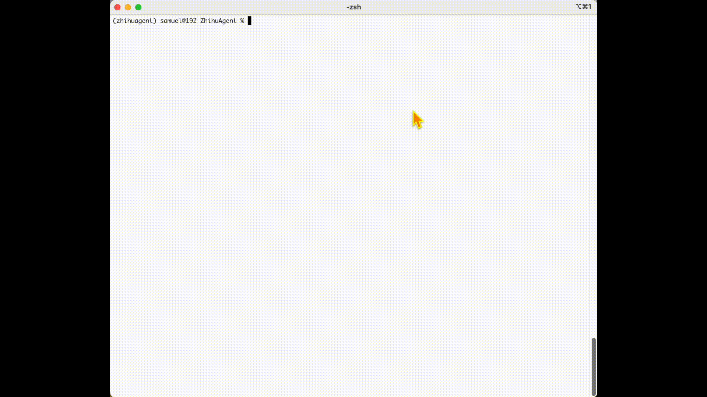

# ZhihuAgent

<p align="center">
    <a href="https://github.com/SamuelGong/ZhihuAgent/blob/main/LICENSE"></a>
    
</p>



**ZhihuAgent** 是一款基于大型语言模型的知乎收藏问答助手。它能够从你的收藏夹中检索最相关的内容，提取关键信息、智能拼合，从而生成一份逻辑清晰、观点有据的参考答案（如果知识库中没有相关内容，则不会强行作答）。

## 🎞️ 项目概览

### 💡 制作动机

这个工具的意义，大概是盘活尘封已久的收藏内容——那些曾经打动自己、原本打算反复咀嚼却因生活节奏搁置的文字和经验。既然真诚点赞、亲手收藏，它们多半是贴合自己的真实关切。**何不多多作用于生活场景、激发具体行动？**

就像那些遥远的大师事迹，再有干货，大多只得淌过人们的大脑、了然无痕；反倒是身边人的成果，哪怕再小，因为关系更近、熟悉感更强，更容易激发模仿实践。将聒噪的信息世界比作社会，收藏夹就是应该常来常往的「熟人圈」吧。

### ⚙️ 技术原理

ZhihuAgent 在回答问题时，其唯一目标是从本地知识库中检索最有相关性的内容，进而生成有依据的回复。

#### 📦 知识库构建【离线阶段】

为了实现高效且可扩展的内容检索，ZhihuAgent 采用以下预处理流程：

每篇文档（图文一并处理）会生成并持久化以下元数据：
- 文档摘要；
- 从摘要中提取的关键词；
- 文档在语义空间中的向量表示。

之后：
- 所有关键词将进行层级聚合，压缩至实用规模并建立倒排索引；
- 所有语义向量将导入向量数据库并完成索引。

#### 🤖 深度问答【在线阶段】

在收到用户问题后，ZhihuAgent 会：
- 将问题转为语义向量，在向量数据库中快速检索最相关文档；
- 利用倒排索引，从关键词出发扩展并找到可能有助于回答问题的其他文档；
- 针对每篇相关文档生成「局部回复」，即该文档视角下的问题答案；
- 汇总并融合所有局部回复，形成结构清晰、视角多元的「全局回答」。

> 特别说明：为了确保生成答案基于知识库内容而非语言模型自身的「幻觉」，ZhihuAgent 设计了专门的提示词模板与生成参数配置，以避免无依据的编造性回答误导用户。

## 💻 上手指南

在使用 ZhihuAgent 前，请先完成一次性配置，用于接入兼容 OpenAI 的 API：

```python
cp config.yml_template config.yml
vim config.yml
# 如您有其他参数选择（包括大语言模型类别），请在此作出并保存对应更改

cp .env_template .env
vim .env
# 填入并保存您的 OpenAI-兼容 API 的调用参数
# OPENAI_API_KEY=
# OPENAI_BASE_URL=
```

### 🧠 构建知识库【离线阶段】

确保你已将收集的知乎内容（markdown 格式）存放至 knowledge/raw 目录中（支持嵌套子文件夹结构）。

然后，创建虚拟环境并安装依赖：

```python
conda create -n zhihuagent Python=3.12 -y
conda activate zhihuagent
pip install -r requirements.txt
```

开始构建知识库：

```python
python construct.py
```

### 🔍提问与回答【在线阶段】

启动主程序：

```python
python main.py
# 在提示词后填入您的问题后敲击回车即可
```

预期结果将如上图所示。

## 🔄 通用性与可扩展性
虽然 ZhihuAgent 以「知乎收藏文章」作为示例知识库进行构建和演示，但整个系统的设计从一开始就具备高度的通用性和跨领域能力。本质上，ZhihuAgent 构建的是一个结构化的语义检索与多文档问答框架，**并未对内容来源、风格或领域做出任何限制**。因此，只要您的资料能整理为文本形式（当前支持 Markdown、后面可以拓展支持纯文本、PDF 等），就可以使用相同的流程构建知识库并进行问答。

这意味着您可以轻松将 ZhihuAgent 改造并应用于：
- 政务文档问答：提升政府信息公开材料的可查找性和实用性；
- 商业资料检索：如员工手册、项目方案、合同范本等的智能问答；
- 学术知识辅助：用于个人论文库、会议记录、参考资料的高效答疑；
- 跨领域混合知识库：支持内容风格和主题高度异构的文档共存，并从多个角度综合给出回答。

## 🤗 支持

如需进一步功能扩展或界面优化，欢迎提交 PR、Issues，或联系 [Zhifeng Jiang](zjiangaj@connect.ust.hk).