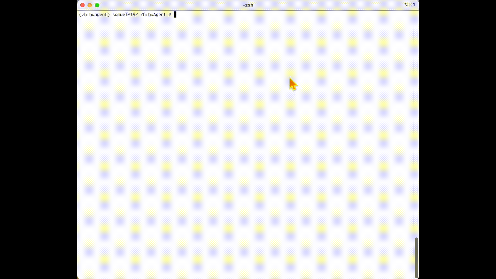

# ZhihuAgent

<p align="center">
    <a href="https://github.com/SamuelGong/ZhihuAgent/blob/main/LICENSE"></a>
    
</p>

> Other languages：[中文](README.md)

| <br>Answering based on a custom knowledge base: traceable sources, diverse and clear viewpoints | <br>Answering based on the LLM's own knowledge: lacks context, correct yet vague  |
|:-------------------------------------------------------------------------------------------------------------------------:|:---------------------------------------------------------------------------------------------------------:|

**ZhihuAgent** is a Zhihu Q&A assistant powered by large language models. It retrieves the most relevant content from your bookmarks, extracts key information, and intelligently merges it to generate a well-reasoned and logically coherent reference answer. If no relevant content is found in the knowledge base, it refrains from giving an answer.

## 🎞️ Project Overview

### 💡 Motivation

The idea behind this tool is to bring new life to long-forgotten bookmarked content—those articles and insights that once resonated with you but were sidelined due to life’s fast pace. Since you liked and bookmarked them sincerely, they probably reflect your true interests. So **why not apply them more in real-life scenarios and inspire concrete action**?

Much like distant legends of great masters, no matter how insightful, they tend to just pass through our minds without impact. In contrast, even small successes by people close to us can be more relatable and easier to emulate. If the noisy online world is like a society, then your bookmarks should be your "familiar circle"—frequently visited and deeply connected.

### ⚙️ Technical Overview

ZhihuAgent's sole goal when answering questions is to retrieve the most relevant content from the local knowledge base and generate a response grounded in that content.

<p align="center">
    
</p>

#### 📦 Knowledge Base Construction (Offline Phase)

To enable efficient and scalable retrieval, ZhihuAgent follows this preprocessing workflow:

For each document (text and images processed together), the following metadata is generated and stored:
- Document summary;
- Keywords extracted from the summary;
- Semantic vector representation of the document;

Then：
- Keywords are hierarchically aggregated to practical size and inverted index is built;
- All semantic vectors are imported into a vector database and indexed.

<p align="center">
    
</p>


#### 🤖 Deep Q&A (Online Phase)

When a user submits a question, ZhihuAgent will:：
- Convert the question into a semantic vector and retrieve the most relevant documents from the vector database;
- Use the inverted index to expand from keywords and find other potentially helpful documents;
- Generate a “local response” for each relevant document, i.e., an answer from that document’s perspective;
- Summarize and merge all local responses into a structured, multi-perspective “global answer”.

> Note: To ensure answers are based on the knowledge base and not hallucinated by the language model, ZhihuAgent uses a carefully designed prompt template and generation settings to avoid ungrounded content.

<p align="center">
    
</p>

## 💻 Getting Started

Before using ZhihuAgent, complete a one-time configuration to connect with an OpenAI-compatible API:

```python
cp config.yml_template config.yml
vim config.yml
# Modify and save any parameters (including model choice) if needed

cp .env_template .env
vim .env
# Fill in and save your OpenAI-compatible API credentials
# OPENAI_API_KEY=
# OPENAI_BASE_URL=
```

### 🧠 Building the Knowledge Base (Offline Phase)

Make sure your collected Zhihu content (in Markdown format) is stored in the `knowledge/raw` directory (nested subfolders supported).

Then, create a virtual environment and install dependencies:

```python
conda create -n zhihuagent Python=3.12 -y
conda activate zhihuagent
pip install -r requirements.txt
```

Build the knowledge base:

```python
python construct.py
```

### 🔍 Ask Questions and Get Answers (Online Phase)

Start the main program:

```python
python main.py
# Type your question at the prompt and press Enter
```

Expected output will be similar to the [GIF above](assets/ZhihuAgent.gif).


## 🔄 Generalization & Scalability
Although ZhihuAgent is demonstrated with Zhihu bookmarks as the sample knowledge base, the entire system is designed from the start to be highly general and cross-domain. Essentially, ZhihuAgent is a structured semantic retrieval and multi-document Q&A framework with **no restrictions on content source, style, or domain**.

So long as your materials can be organized in text form (currently supports Markdown, with planned support for plain text, PDF, etc.), you can use the same pipeline to build a knowledge base and perform Q&A.

This means you can easily adapt ZhihuAgent for:
- Government document Q&A: Improve accessibility and usefulness of public information;
- Business material retrieval: Intelligent Q&A for handbooks, project plans, contracts, etc;
- Academic knowledge support: Efficient querying of personal paper collections, conference notes, references;
- Cross-domain hybrid knowledge bases: Handle diverse styles and topics, and generate well-rounded answers.

> ✅ Key Advantage: ZhihuAgent does not assume content consistency. Each document is treated as an independent source of perspective, making it naturally suited for cross-domain knowledge integration and complex query answering.

## 🤗 Support

For feature requests or UI improvements, feel free to submit PRs, issues, or contact [Zhifeng Jiang](zjiangaj@connect.ust.hk).